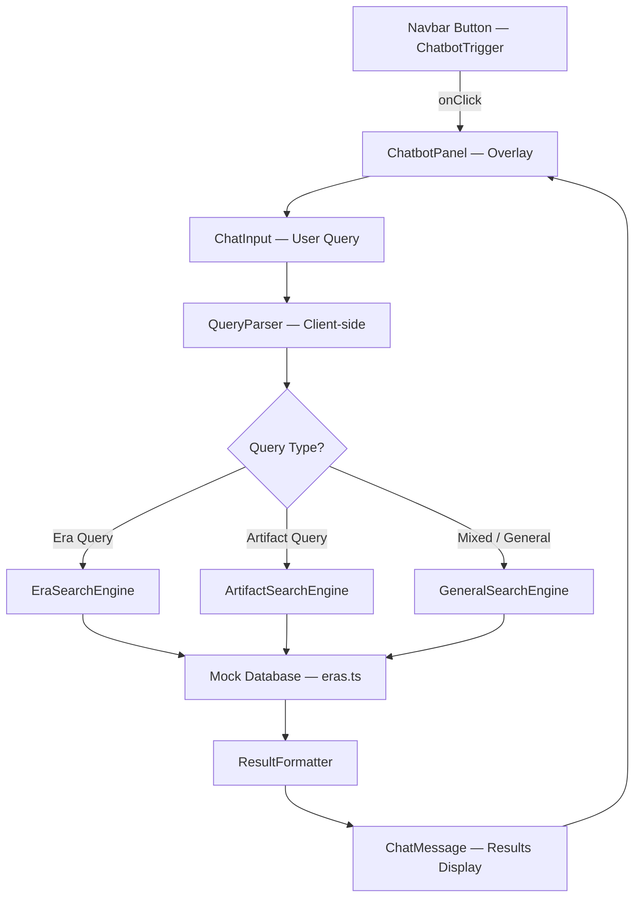
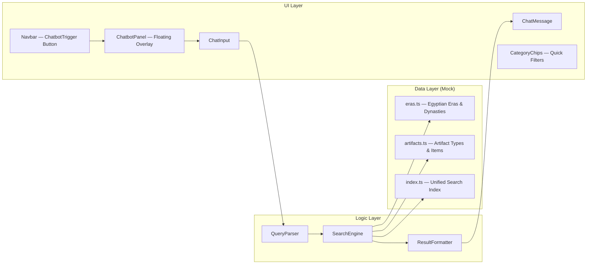
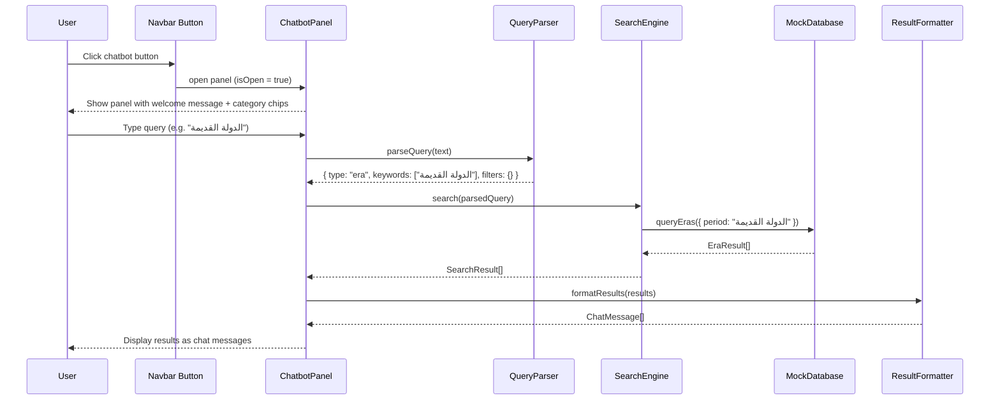
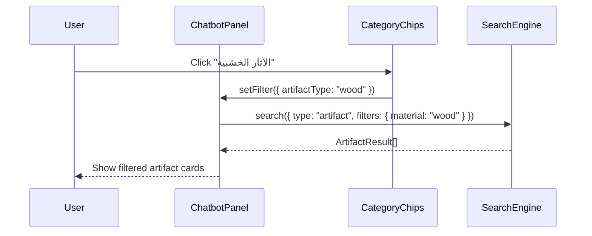

# وثيقة التصميم: Archaeology Chatbot

## نظرة عامة

شات بوت متكامل يُضاف إلى موقع Next.js الخاص بكلية الآثار، يظهر كزرار ثابت في الـ Navbar ويفتح واجهة بحث تفاعلية تتيح للمستخدم الاستفسار عن العصور المصرية القديمة وأنواع الآثار المختلفة. يعمل الشات بوت كـ search interface داخل قاعدة بيانات الموقع (mock data في المرحلة الأولى)، مع واجهة بصرية متناسقة مع الهوية البصرية الحالية للموقع (ألوان ذهبية، خلفيات داكنة، خطوط monospace).

الشات بوت لا يعتمد على نموذج لغوي خارجي في المرحلة الأولى — بل يُحلل استعلام المستخدم محلياً ويبحث في بيانات mock منظمة، مما يجعله سريعاً وقابلاً للتطوير لاحقاً لإضافة AI حقيقي.

---

## Architecture (High-Level)





---

## Sequence Diagrams

### تدفق البحث الأساسي



### تدفق الفلترة بالتصنيفات



---

## Components and Interfaces

### Component 1: ChatbotTrigger (في Navbar)

**Purpose**: زرار ثابت في الـ Navbar يفتح/يغلق لوحة الشات بوت

**Interface**:
```typescript
interface ChatbotTriggerProps {
  isOpen: boolean
  onToggle: () => void
  unreadCount?: number
}
```

**Responsibilities**:
- عرض أيقونة الشات بوت (مثلاً: أيقونة هيروغليفية أو مجهر)
- إظهار badge عند وجود نتائج جديدة
- Animation عند الفتح/الإغلاق
- متناسق مع الـ accent color الذهبي `#C9A84C`

---

### Component 2: ChatbotPanel

**Purpose**: اللوحة الرئيسية للشات بوت — overlay يظهر فوق المحتوى

**Interface**:
```typescript
interface ChatbotPanelProps {
  isOpen: boolean
  onClose: () => void
}

interface ChatbotPanelState {
  messages: ChatMessage[]
  inputValue: string
  isLoading: boolean
  activeFilter: FilterState | null
}
```

**Responsibilities**:
- إدارة قائمة الرسائل (messages history)
- عرض CategoryChips للتصفية السريعة
- إرسال الاستعلامات وعرض النتائج
- Scroll تلقائي لآخر رسالة
- رسالة ترحيب عند الفتح الأول

---

### Component 3: CategoryChips

**Purpose**: أزرار تصفية سريعة للعصور وأنواع الآثار

**Interface**:
```typescript
interface CategoryChipsProps {
  onSelect: (category: SearchCategory) => void
  activeCategory: SearchCategory | null
}

type SearchCategory =
  | { type: "era"; value: EraId }
  | { type: "artifact"; value: ArtifactMaterial }
  | { type: "dynasty"; value: string }
```

**الفئات المعروضة**:

| الفئة | النوع | القيمة |
|-------|-------|--------|
| الدولة القديمة | era | old-kingdom |
| الدولة الوسطى | era | middle-kingdom |
| الدولة الحديثة | era | new-kingdom |
| عصر الانتقال الأول | era | first-intermediate |
| عصر الانتقال الثاني | era | second-intermediate |
| عصر الانتقال الثالث | era | third-intermediate |
| العصر المتأخر | era | late-period |
| آثار خشبية | artifact | wood |
| آثار معدنية | artifact | metal |
| تماثيل | artifact | statues |
| أثاث | artifact | furniture |
| فخار | artifact | pottery |
| مجوهرات | artifact | jewelry |
| بردي | artifact | papyrus |

---

### Component 4: ChatMessage

**Purpose**: عرض رسالة واحدة (من المستخدم أو من النظام)

**Interface**:
```typescript
interface ChatMessageProps {
  message: ChatMessageData
}

interface ChatMessageData {
  id: string
  role: "user" | "assistant"
  content: string
  results?: SearchResult[]
  timestamp: Date
  type: "text" | "results" | "welcome" | "error"
}
```

---

### Component 5: SearchResultCard

**Purpose**: بطاقة عرض نتيجة بحث واحدة (أثر أو عصر)

**Interface**:
```typescript
interface SearchResultCardProps {
  result: SearchResult
  accentColor: string
}

type SearchResult = EraResult | ArtifactResult

interface EraResult {
  kind: "era"
  id: string
  name: string
  nameAr: string
  period: string
  dynasties: Dynasty[]
  description: string
  keyFindings: string[]
  link?: string
}

interface ArtifactResult {
  kind: "artifact"
  id: string
  name: string
  nameAr: string
  material: ArtifactMaterial
  era: string
  museum: string
  description: string
  imageUrl?: string
  link?: string
}
```

---

## Data Models

### نموذج العصور المصرية

```typescript
type EraId =
  | "predynastic"
  | "early-dynastic"
  | "old-kingdom"
  | "first-intermediate"
  | "middle-kingdom"
  | "second-intermediate"
  | "new-kingdom"
  | "third-intermediate"
  | "late-period"
  | "greco-roman"
  | "islamic"

interface Dynasty {
  number: number
  nameAr: string
  nameEn: string
  startYear: number  // negative = BC
  endYear: number
  capital: string
  notableRulers: string[]
  keyEvents: string[]
}

interface EraRecord {
  id: EraId
  nameAr: string
  nameEn: string
  startYear: number
  endYear: number
  dynasties: Dynasty[]
  description: string
  characteristics: string[]
  keyArtifacts: string[]
  relatedPageLink?: string
}
```

### نموذج الآثار

```typescript
type ArtifactMaterial =
  | "wood"
  | "metal"
  | "stone"
  | "pottery"
  | "papyrus"
  | "jewelry"
  | "statues"
  | "furniture"
  | "textile"
  | "glass"

interface ArtifactRecord {
  id: string
  nameAr: string
  nameEn: string
  material: ArtifactMaterial
  subType: string
  era: EraId
  dynasty?: number
  approximateDate: string
  museum: string
  museumLocation: string
  dimensions?: string
  condition: "excellent" | "good" | "fair" | "poor"
  description: string
  conservationNotes?: string
  imageUrl?: string
  relatedPageLink?: string
}
```

### نموذج الاستعلام والنتائج

```typescript
interface ParsedQuery {
  originalText: string
  type: "era" | "artifact" | "dynasty" | "mixed" | "general"
  keywords: string[]
  filters: {
    eraId?: EraId
    material?: ArtifactMaterial
    dynastyNumber?: number
    yearRange?: { from: number; to: number }
  }
  language: "ar" | "en" | "mixed"
}

interface SearchResponse {
  query: ParsedQuery
  results: SearchResult[]
  totalCount: number
  suggestions: string[]
  executionTimeMs: number
}
```

---

## Algorithmic Pseudocode (Low-Level)

### خوارزمية تحليل الاستعلام (QueryParser)

```pascal
ALGORITHM parseQuery(rawText)
INPUT: rawText: string
OUTPUT: ParsedQuery

BEGIN
  // Step 1: Normalize text
  normalized ← toLowerCase(trim(rawText))
  language ← detectLanguage(normalized)  // "ar" | "en" | "mixed"

  // Step 2: Extract keywords
  keywords ← tokenize(normalized)
  keywords ← removeStopWords(keywords, language)

  // Step 3: Detect query type
  type ← "general"

  IF containsAny(keywords, ERA_KEYWORDS) THEN
    type ← "era"
  END IF

  IF containsAny(keywords, ARTIFACT_KEYWORDS) THEN
    IF type = "era" THEN
      type ← "mixed"
    ELSE
      type ← "artifact"
    END IF
  END IF

  IF containsAny(keywords, DYNASTY_KEYWORDS) THEN
    type ← "dynasty"
  END IF

  // Step 4: Extract filters
  filters ← {}

  FOR each keyword IN keywords DO
    IF keyword IN ERA_ID_MAP THEN
      filters.eraId ← ERA_ID_MAP[keyword]
    END IF
    IF keyword IN MATERIAL_MAP THEN
      filters.material ← MATERIAL_MAP[keyword]
    END IF
    IF keyword MATCHES DYNASTY_PATTERN THEN
      filters.dynastyNumber ← extractDynastyNumber(keyword)
    END IF
  END FOR

  RETURN {
    originalText: rawText,
    type: type,
    keywords: keywords,
    filters: filters,
    language: language
  }
END
```

**Preconditions:**
- `rawText` is a non-empty string
- Keyword maps (ERA_KEYWORDS, ARTIFACT_KEYWORDS, etc.) are initialized

**Postconditions:**
- Returns a valid `ParsedQuery` object
- `type` is always one of the defined enum values
- `keywords` array contains at least one element if rawText is non-empty

---

### خوارزمية البحث (SearchEngine)

```pascal
ALGORITHM search(query)
INPUT: query: ParsedQuery
OUTPUT: SearchResponse

BEGIN
  results ← []
  startTime ← now()

  // Step 1: Route to appropriate search function
  IF query.type = "era" OR query.type = "mixed" THEN
    eraResults ← searchEras(query)
    results ← results + eraResults
  END IF

  IF query.type = "artifact" OR query.type = "mixed" THEN
    artifactResults ← searchArtifacts(query)
    results ← results + artifactResults
  END IF

  IF query.type = "dynasty" THEN
    dynastyResults ← searchDynasties(query)
    results ← results + dynastyResults
  END IF

  IF query.type = "general" OR results.length = 0 THEN
    generalResults ← fullTextSearch(query.keywords)
    results ← results + generalResults
  END IF

  // Step 2: Score and sort results
  FOR each result IN results DO
    result.score ← calculateRelevanceScore(result, query)
  END FOR

  results ← sortByScore(results, descending)

  // Step 3: Deduplicate
  results ← deduplicate(results, by: "id")

  // Step 4: Generate suggestions
  suggestions ← generateSuggestions(query, results)

  RETURN {
    query: query,
    results: results[0..9],  // max 10 results
    totalCount: results.length,
    suggestions: suggestions,
    executionTimeMs: now() - startTime
  }
END
```

**Preconditions:**
- `query` is a valid `ParsedQuery` object
- Mock database is loaded and accessible

**Postconditions:**
- Returns at most 10 results
- Results are sorted by relevance score (descending)
- No duplicate results (same id)
- `executionTimeMs` reflects actual processing time

**Loop Invariants:**
- During scoring loop: all previously scored results maintain their scores
- `results` array grows monotonically until deduplication

---

### خوارزمية حساب درجة الصلة (Relevance Scoring)

```pascal
ALGORITHM calculateRelevanceScore(result, query)
INPUT: result: SearchResult, query: ParsedQuery
OUTPUT: score: number (0.0 - 1.0)

BEGIN
  score ← 0.0

  // Exact name match → highest weight
  IF result.nameAr CONTAINS query.originalText THEN
    score ← score + 0.5
  END IF

  // Keyword matches in name
  FOR each keyword IN query.keywords DO
    IF result.nameAr CONTAINS keyword THEN
      score ← score + 0.2
    END IF
    IF result.description CONTAINS keyword THEN
      score ← score + 0.1
    END IF
  END FOR

  // Filter match bonus
  IF query.filters.eraId IS NOT NULL AND result.era = query.filters.eraId THEN
    score ← score + 0.3
  END IF

  IF query.filters.material IS NOT NULL AND result.material = query.filters.material THEN
    score ← score + 0.3
  END IF

  // Normalize to [0, 1]
  score ← min(score, 1.0)

  RETURN score
END
```

---

### خوارزمية البحث في العصور

```pascal
ALGORITHM searchEras(query)
INPUT: query: ParsedQuery
OUTPUT: EraResult[]

BEGIN
  candidates ← ALL_ERAS

  // Apply era filter if present
  IF query.filters.eraId IS NOT NULL THEN
    candidates ← candidates WHERE id = query.filters.eraId
  END IF

  // Apply dynasty filter if present
  IF query.filters.dynastyNumber IS NOT NULL THEN
    candidates ← candidates WHERE dynasties CONTAINS dynastyNumber
  END IF

  // Full-text filter on remaining candidates
  IF query.keywords.length > 0 THEN
    candidates ← candidates WHERE
      nameAr CONTAINS_ANY query.keywords
      OR nameEn CONTAINS_ANY query.keywords
      OR description CONTAINS_ANY query.keywords
      OR dynasties[*].nameAr CONTAINS_ANY query.keywords
  END IF

  RETURN candidates MAP toEraResult
END
```

---

## Key Functions with Formal Specifications

### `parseQuery(rawText: string): ParsedQuery`

**Preconditions:**
- `rawText.trim().length > 0`

**Postconditions:**
- `result.originalText === rawText`
- `result.type ∈ { "era", "artifact", "dynasty", "mixed", "general" }`
- `result.keywords.length >= 0`
- `result.language ∈ { "ar", "en", "mixed" }`

---

### `search(query: ParsedQuery): SearchResponse`

**Preconditions:**
- `query` is a valid `ParsedQuery` (returned from `parseQuery`)
- Mock database is initialized

**Postconditions:**
- `result.results.length <= 10`
- All results in `result.results` have `score > 0` (only relevant results)
- `result.totalCount >= result.results.length`
- `result.executionTimeMs >= 0`

---

### `formatResults(response: SearchResponse): ChatMessageData`

**Preconditions:**
- `response` is a valid `SearchResponse`

**Postconditions:**
- Returns a `ChatMessageData` with `role === "assistant"`
- If `response.results.length === 0` → `type === "text"` with "لا توجد نتائج" message
- If `response.results.length > 0` → `type === "results"` with results array

---

## Example Usage

```typescript
// 1. User opens chatbot
const [isOpen, setIsOpen] = useState(false)
// → ChatbotTrigger renders in Navbar, onClick sets isOpen = true

// 2. User types a query
const query = "الدولة القديمة الأسرة الرابعة"
const parsed = parseQuery(query)
// parsed = {
//   type: "dynasty",
//   keywords: ["الدولة", "القديمة", "الأسرة", "الرابعة"],
//   filters: { eraId: "old-kingdom", dynastyNumber: 4 },
//   language: "ar"
// }

// 3. Search executes
const response = search(parsed)
// response.results = [
//   { kind: "era", nameAr: "الدولة القديمة", dynasties: [...] },
//   { kind: "artifact", nameAr: "تمثال خوفو", era: "old-kingdom", ... }
// ]

// 4. User clicks CategoryChip "آثار خشبية"
const chipQuery = parseQuery("آثار خشبية")
// chipQuery = { type: "artifact", filters: { material: "wood" } }

// 5. Mock data example
const mockEra: EraRecord = {
  id: "old-kingdom",
  nameAr: "الدولة القديمة",
  nameEn: "Old Kingdom",
  startYear: -2686,
  endYear: -2181,
  dynasties: [
    {
      number: 3,
      nameAr: "الأسرة الثالثة",
      nameEn: "Third Dynasty",
      startYear: -2686,
      endYear: -2613,
      capital: "منف",
      notableRulers: ["زوسر", "سنفرو"],
      keyEvents: ["بناء هرم زوسر المدرج"]
    },
    {
      number: 4,
      nameAr: "الأسرة الرابعة",
      nameEn: "Fourth Dynasty",
      startYear: -2613,
      endYear: -2494,
      capital: "منف",
      notableRulers: ["خوفو", "خفرع", "منقرع"],
      keyEvents: ["بناء أهرامات الجيزة", "أبو الهول"]
    }
  ],
  description: "عصر ازدهار الحضارة المصرية وبناء الأهرامات الكبرى",
  characteristics: ["بناء الأهرامات", "مركزية الحكم", "ازدهار الفنون"],
  keyArtifacts: ["تمثال خوفو العاجي", "لوحة نارمر"]
}
```

---

## Correctness Properties

- **P1 — Completeness**: لكل استعلام يحتوي على اسم عصر صحيح، يجب أن تحتوي النتائج على ذلك العصر: `∀ query: query.filters.eraId ≠ null ⟹ ∃ result ∈ results: result.era === query.filters.eraId`
- **P2 — Relevance Bound**: درجة الصلة دائماً في النطاق [0, 1]: `∀ result ∈ results: 0.0 ≤ result.score ≤ 1.0`
- **P3 — Result Limit**: عدد النتائج المُعادة لا يتجاوز 10: `results.length ≤ 10`
- **P4 — No Duplicates**: لا توجد نتائج مكررة بنفس الـ id: `∀ i ≠ j: results[i].id ≠ results[j].id`
- **P5 — Sort Order**: النتائج مرتبة تنازلياً حسب الصلة: `∀ i < j: results[i].score ≥ results[j].score`
- **P6 — Empty Query Handling**: الاستعلام الفارغ لا يُنتج نتائج ولا يُسبب خطأ: `parseQuery("").keywords.length === 0 ⟹ search(query).results === []`

---

## Error Handling

### سيناريو 1: استعلام فارغ

**الحالة**: المستخدم يضغط Enter بدون كتابة نص
**الاستجابة**: لا يُرسل الاستعلام، يظهر placeholder hint
**التعافي**: لا حاجة — الزرار معطل عند input فارغ

### سيناريو 2: لا توجد نتائج

**الحالة**: الاستعلام صحيح لكن لا يوجد تطابق في البيانات
**الاستجابة**: رسالة "لم أجد نتائج لـ '[query]'. جرب البحث عن: [suggestions]"
**التعافي**: عرض اقتراحات بحث بديلة من `response.suggestions`

### سيناريو 3: خطأ في تحليل الاستعلام

**الحالة**: نص غير متوقع أو أحرف خاصة
**الاستجابة**: fallback إلى `type: "general"` وبحث full-text
**التعافي**: البحث يستمر بدون فلاتر

### سيناريو 4: Panel يُفتح على صفحة Home

**الحالة**: الـ Navbar لا يظهر على الـ Home page حالياً
**الاستجابة**: إضافة ChatbotTrigger كـ floating button مستقل على الـ Home page
**التعافي**: الزرار يعمل على جميع الصفحات بما فيها Home

---

## Testing Strategy

### Unit Testing

- `parseQuery` — اختبار جميع أنواع الاستعلامات (عربي، إنجليزي، مختلط، فارغ)
- `calculateRelevanceScore` — التحقق من أن الدرجة دائماً في [0, 1]
- `search` — التحقق من حد 10 نتائج وعدم التكرار
- `formatResults` — التحقق من صحة بنية `ChatMessageData`

### Property-Based Testing

**مكتبة**: fast-check (موجودة في المشروع عبر Radix/Zod ecosystem)

**الخصائص المُختبرة**:
- لأي نص عشوائي: `parseQuery(text).originalText === text`
- لأي استعلام: `search(query).results.length <= 10`
- لأي نتيجتين: `results[i].score >= results[i+1].score` (ترتيب صحيح)

### Integration Testing

- فتح الـ Panel وإرسال استعلام والتحقق من ظهور النتائج
- الضغط على CategoryChip والتحقق من تصفية النتائج
- إغلاق الـ Panel والتحقق من مسح الـ state

---

## Performance Considerations

- البحث يعمل client-side بالكامل — لا latency من network
- Mock data يُحمَّل مرة واحدة عند أول فتح للـ Panel (lazy loading)
- نتائج البحث تُخزَّن في cache لمدة session (useMemo على آخر 5 استعلامات)
- الـ Panel يستخدم `position: fixed` مع `z-index` عالٍ لتجنب layout shifts
- Debounce على الـ input بـ 300ms لتجنب البحث عند كل حرف

---

## Security Considerations

- جميع البيانات mock ومحلية — لا API calls خارجية
- الـ input يُعقَّم (sanitize) قبل المعالجة لمنع XSS
- لا يوجد تخزين لبيانات المستخدم (no localStorage, no cookies)
- عند إضافة AI لاحقاً: يجب تشفير الاستعلامات وعدم إرسال بيانات حساسة

---

## Dependencies

| الاعتمادية | الاستخدام | موجودة؟ |
|------------|-----------|---------|
| `next` 15.x | App Router, Client Components | ✅ |
| `react` 19.x | State management, hooks | ✅ |
| `lucide-react` | أيقونات الشات بوت | ✅ |
| `@radix-ui/react-dialog` | Panel overlay | ✅ |
| `tailwindcss` | Styling | ✅ |
| `clsx` / `tailwind-merge` | Conditional classes | ✅ |
| `zod` | Validation لـ mock data schema | ✅ |
| `framer-motion` | Animations للـ Panel | ❌ — يمكن الاستغناء عنه باستخدام CSS transitions |

جميع الاعتماديات المطلوبة موجودة بالفعل في المشروع — لا حاجة لتثبيت أي حزمة جديدة.

---

## File Structure المقترح

```
src/
├── components/
│   ├── chatbot/
│   │   ├── ChatbotTrigger.tsx       ← زرار في Navbar
│   │   ├── ChatbotPanel.tsx         ← اللوحة الرئيسية
│   │   ├── ChatInput.tsx            ← حقل الإدخال
│   │   ├── ChatMessage.tsx          ← عرض رسالة واحدة
│   │   ├── CategoryChips.tsx        ← أزرار التصفية السريعة
│   │   ├── SearchResultCard.tsx     ← بطاقة نتيجة واحدة
│   │   └── index.ts                 ← exports
│   └── Navbar.tsx                   ← تعديل لإضافة ChatbotTrigger
├── lib/
│   ├── chatbot/
│   │   ├── queryParser.ts           ← تحليل الاستعلام
│   │   ├── searchEngine.ts          ← محرك البحث
│   │   ├── resultFormatter.ts       ← تنسيق النتائج
│   │   └── types.ts                 ← جميع الأنواع
│   └── mock-data/
│       ├── eras.ts                  ← بيانات العصور والأسرات
│       ├── artifacts.ts             ← بيانات الآثار
│       └── index.ts                 ← unified search index
└── hooks/
    └── useChatbot.ts                ← custom hook لإدارة state
```

